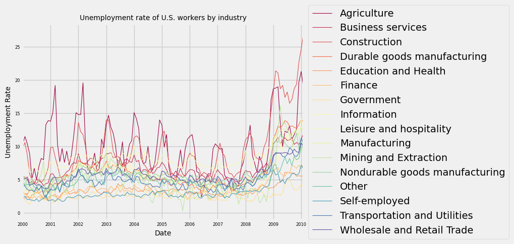
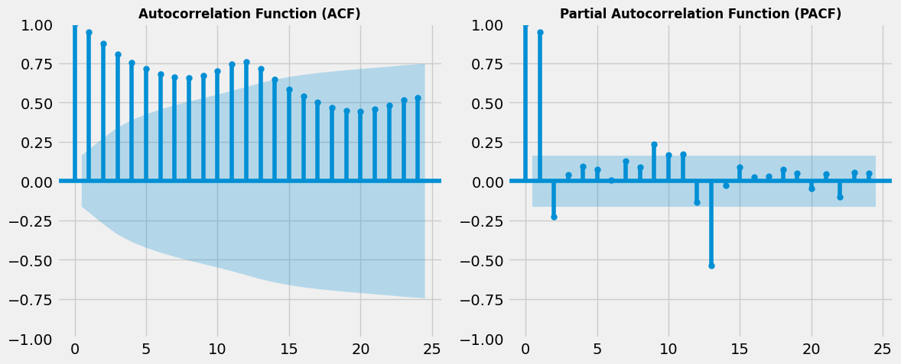
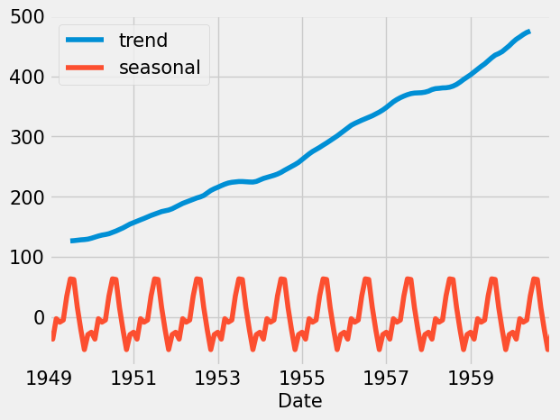
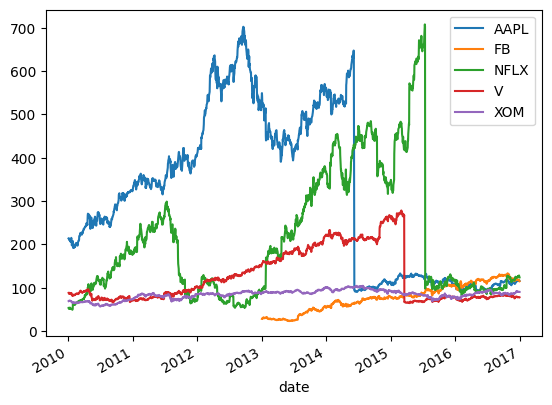
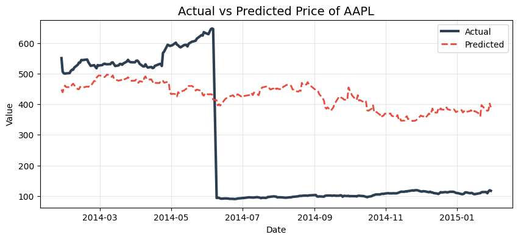
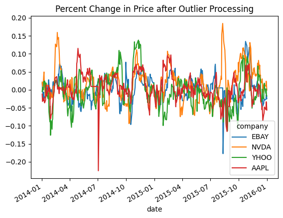

# Time Series Visualizing in Python
Time series visualization in Python, including trend, seasonality, and multi-series exploration using real-world datasets.

## Project goal
This project demonstrates how to explore and visualize time series data using Python. It covers fundamental techniques such as line plotting, decomposition of time series into trend/seasonality, and working with multiple time series datasets.
1. Basic Time Series Visualization
2. Summary Statistics & Diagnostics
3. Trend, Seasonality, and Noise
4. Working with Multiple Time Series

## Tools used
- Python
- Jupyter Notebook
- pandas
- matplotlib
- scikit-learn
- seaborn
- statsmodels
  
## File
- `Time_Series_Visualizing_in_Python.ipynb` and
  `Time_Series_Visualizing_in_Python_part_2.ipynb`: main notebooks for the project

## Reference
Data Camp Course "Visualizing Time Series Data in Python"
Data Camp Course "Machine Learning for Time Series Data in Python"

## Examples

